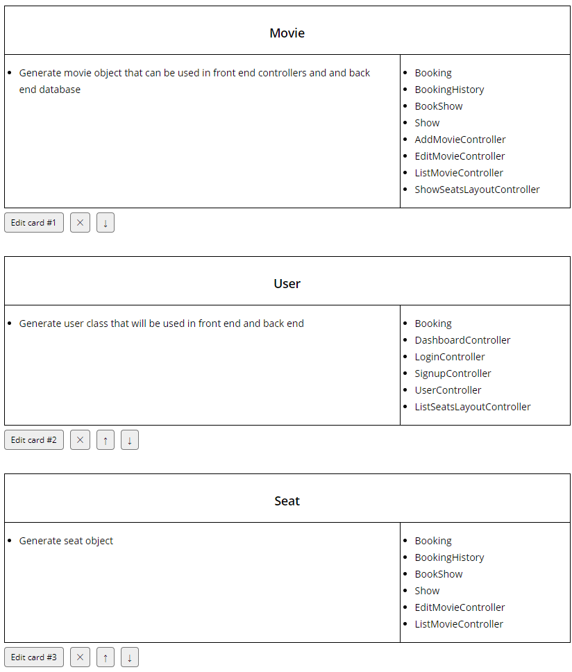
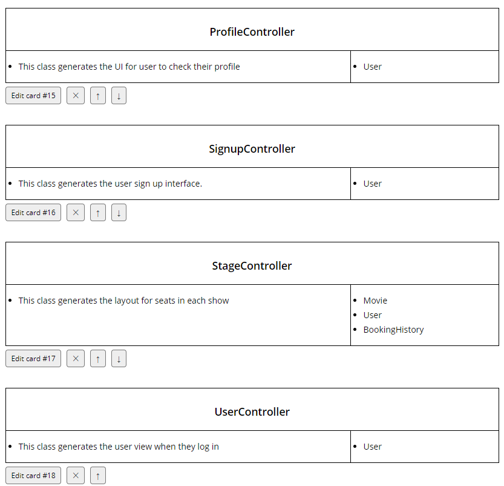
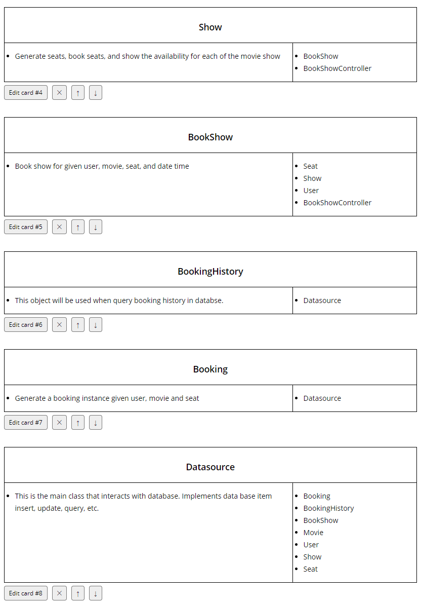
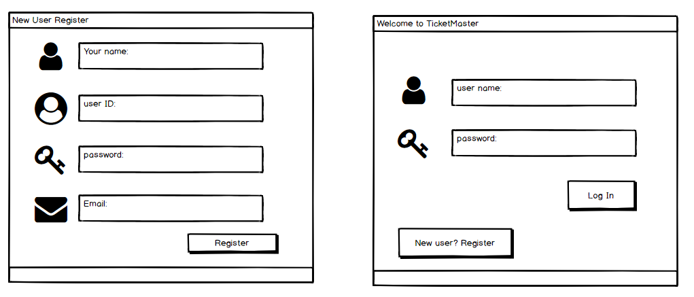
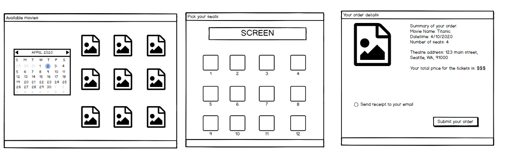
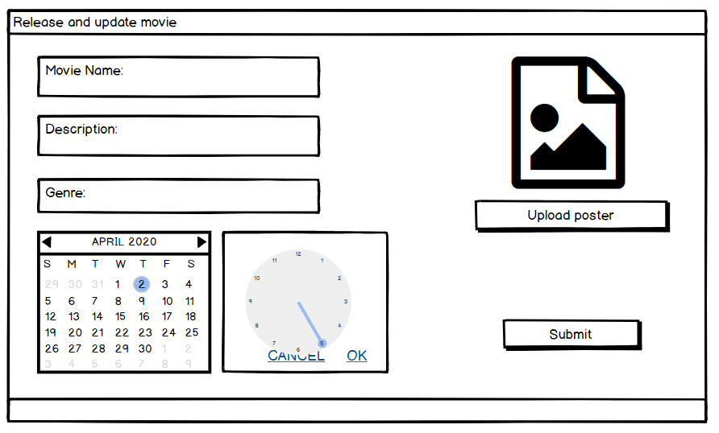
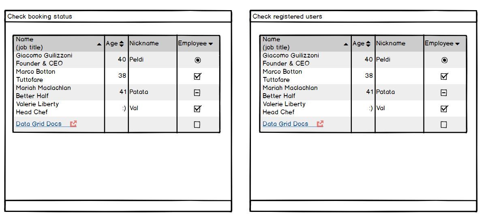

# MCIT 591 Final Project Design: TicketMaster
This is the repository for MCIT 591 course project.

Team 68: Wei Guo, Natalie Diao

April, 2020

Initial Project proposal is [here](https://docs.google.com/document/d/1Vvbymm1ysKuXr427TXe41Lkge4SAd6OOTfM8U_SosO8/edit#).

## Summary
In this project we will build a system for a movie theater. This system serves both customers and theater admins. General customers can browse available movies, select desired dates/seats and make purchase. Theater admins can add new movies, update existing movie's schedules, and run data analysis on sales data. The front end will be implemented in JavaFX and backend data will be stored in SQLite database.

## Major classes

## UI mockups

### User register and log in

### User browse movies and make selection

### Admin updates movie catalog (adding new movies, change existing ones)

### Admin checks users and movie booking status

## Database design
### Tables
- User
	- userName(pk)
	- userFirstName
	- userLastName
	- userEmail
- Movie
	- movieId(pk)
    - name
    - price
    - description
    - date
    - time
- Seat
	- SeatNumber
	- isBooked
- BookingHistory
	- BookingId
	- MovieId
	- SeatNumber

## Timeline
- 4/6: design milestone
- 4/13: implement backend and JavaFX
- 4/20: working version done
- 4/23: final version done
- 4/25: prepare demo
